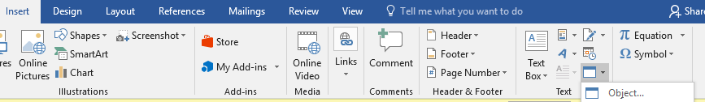
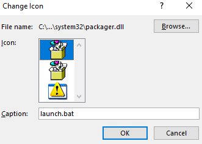

# Microsoft OLE

## Object Linking and Embedding (OLE)

Object Linking & Embedding is a proprietary technology developed by Microsoft that allows embedding and linking to documents and other objects

OLE incorporates many different concepts that all work toward the goal of seamless interaction between applications. These areas include the following:

*   **Linking and Embedding**

    Linking and embedding are the two methods for storing items created inside an OLE document that was created in another application. For general information on the differences between the two, see the article [OLE Background: Linking and Embedding](https://docs.microsoft.com/en-us/cpp/mfc/ole-background-linking-and-embedding?view=msvc-160). For more detailed information, see the articles [Containers](https://docs.microsoft.com/en-us/cpp/mfc/containers?view=msvc-160) and [Servers](https://docs.microsoft.com/en-us/cpp/mfc/servers?view=msvc-160).
*   **In-Place Activation (Visual Editing)**

    Activating an embedded item in the context of the container document is called in-place activation or visual editing. The container application's interface changes to incorporate the features of the component application that created the embedded item. Linked items are never activated in place because the actual data for the item is contained in a separate file, out of the context of the application containing the link. For more information on in-place activation, see the article [Activation](https://docs.microsoft.com/en-us/cpp/mfc/activation-cpp?view=msvc-160).

    &#x20;Note

    Linking and embedding and in-place activation provide the main features of OLE visual editing.
*   **Automation** allows one application to drive another application. The driving application is known as an automation client, and the application being driven is known as an automation server or automation component. For more information on automation, see the articles [Automation Clients](https://docs.microsoft.com/en-us/cpp/mfc/automation-clients?view=msvc-160) and [Automation Servers](https://docs.microsoft.com/en-us/cpp/mfc/automation-servers?view=msvc-160).

    &#x20;Note

    Automation works in both OLE and Active technology contexts. You can automate any object based on COM.
*   **Compound Files**

    Compound files provide a standard file format that simplifies the structured storing of compound documents for OLE applications. Within a compound file, storages have many features of directories and streams have many features of files. This technology is also called structured storage. For more information on compound files, see the article [Containers: Compound Files](https://docs.microsoft.com/en-us/cpp/mfc/containers-compound-files?view=msvc-160).
*   **Uniform Data Transfer**

    Uniform Data Transfer (UDT) is a set of interfaces that allow data to be sent and received in a standard fashion, regardless of the actual method chosen to transfer the data. UDT forms the basis for data transfers by drag and drop. UDT now serves as the basis for existing Windows data transfer, such as the Clipboard and dynamic data exchange (DDE). For more information on UDT, see the article [Data Objects and Data Sources (OLE)](https://docs.microsoft.com/en-us/cpp/mfc/data-objects-and-data-sources-ole?view=msvc-160).
*   **Drag and Drop**

    Drag and drop is an easy-to-use, direct-manipulation technique to transfer data among applications, among windows within an application, or even within a single window in an application. The data to be transferred is selected and dragged to the desired destination. Drag and drop is based on uniform data transfer. For more information on drag and drop, see the article [Drag and Drop](https://docs.microsoft.com/en-us/cpp/mfc/drag-and-drop-ole?view=msvc-160).
*   **Component Object Model**

    The Component Object Model (COM) provides the infrastructure used when OLE objects communicate with each other. The MFC OLE classes simplify COM for the programmer. COM is part of Active technology because COM objects underlie both OLE and Active technology. For more information about COM, see the [Active Template Library (ATL)](https://docs.microsoft.com/en-us/cpp/atl/active-template-library-atl-concepts?view=msvc-160) topics.

This text was extracted from:



## OLE Malicious Files

With OLE we can attach files, like malicious scripts.

### Microsoft Word

In Microsoft Word, we can navigate to the **Insert Tab** and in the **Text Group** we can create an **Object**:



We can select a malicious file from the **Browse** button, choose an icon, and add a caption name:



Then we can follow these steps:

* Save > Open > Double-Click > Execute Allow

## Olevba

olevba is a script written in python that allows you to parse OLE and OpenXML as MS Office documents (word, excel, ...) to extract VBA code Macros in clear text, find and analyze malicious macros

Installation:

```
git clone https://github.com/decalage2/oletools
cd oletools
python3 setup.py install
```

Usage:

```
olevba Currency\ Volume\ Report.xlsm
```

Olevba can find the contents of the document. In some projects, I have found credentials and some macros.


