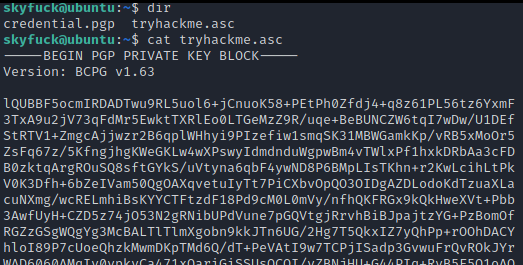

# Password Cracking

## Online Password Cracking







## Offline Password Cracking

### Hashcat



### John



## Creating Wordlists

### Crunch

Crunch basic syntax:

```
crunch min max
```

Crunch example of a complete wordlist:

```
crunch 8 8 -t ,@@^^%%%
```

Placeholders:

* \-t = pattern
* , = uppercase
* @ = lowercase
* % = numeric
* ^ = special characters

An example of predefined characters set:

```
crunch 5 5 -f /usr/share/crunch/charset.lst mixalpha -o filename-crunch.txt
```

### Cewl

We can create a wordlist based on a web page:

```
cewl http://target/
```

A more filtered approach can be the following:

```
cewl www.domain.com -m 6 -w domain-cewl.txt

-m = minimum
-w = wordlist output

# Count Lines
wc -l domain-cewl.txt
```

## Hash Identification

### Hash Identifier

We can use `hash-identifier` to identify a hash:

```
hash-identifier hash_here
```

### Hashid

We can `hashid` to identify a hash:

```
hashid hash_here
```

## Hashcat

Finding hashes algorithms with hashcat:

```
hashcat --example-hashes | grep -i kerberos -A 2 -B 1
hashcat --example-hashes | grep '\$krb5tgs$23\$' -B 2
```

## John

A simple way to crack password hashes with a dictionary attack:

```
john --wordlist=/usr/share/wordlists/rockyou.txt passwords.txt
```

Examples of john usage:

```
john hash.txt --format=NT
john hash.txt --wordlist=/usr/share/wordlists/rockyou.txt --format=NT
john hash.txt --rules --wordlist=/usr/share/wordlists/rockyou.txt --format=NT 
```

### John Configuration

The john configuration file is this one:

```
cat /etc/john/john.conf
```

### Converting Formats for John

```
find / -name '*2john' 2>/dev/null
```

As an example, we could 7z2john:

```sh
/opt/john/run/7z2john.pl backup.7z > backup.hash
```

This GitHub repo has more converters:



## Convert Formats

JohnTheRipper has a collection of \<something>2john to convert the format to a format that john understands:



### Crack RAR Files

We can use the `rar2john` binary that comes with John to get a hash from the password protected RAR file.

```
rar2john <archive.rar>
```

Use hashcat or john to crack the hash:

```
hashcat -m 13000 hash.txt rockyou.txt
```

After the hash has been cracked, you can then extract the archive:

```
unrar e <archive.rar>

# enter the password
```

### Crack GPG Files

If you have a file that looks like this:



Then you can try to convert the file to a format that john understands:

```shell
gpg2john tryhackme.asc > hash.txt
```

Attempt to crack it:

```shell
sudo john --wordlist=/usr/share/wordlists/rockyoy.txt hash.txt
```

If you are able to crack it, then you can decipher it:

```shell
gpg --import tryhackme.asc
gpg -d credential.pgp
```

## Misc

### Crack an OpenSSL Password

Bruteforce an OpenSSL encrypted file:

```bash
#!/bin/bash

function ctrl_c(){
    echo -e "\n[!] Exiting...\n"
    exit 1
}

#Ctrl+C
trap ctrl_c INT

# Iterate over each line in passwords.txt
for password in $(cat passwords.txt); do
    # AES-256-CBC is the most common cipher in OpenSSL, you may change it...
    openssl aes-256-cvc -d -in filename.crypted -out filename.txt -k $password 2>/dev/null
    # If successful then print the password, hence the reason for the status code "0".
    if [ "$(echo $?)" == "0" ]; then
        echo -e "\n[+] The password is: $password\n"
        exit 0
    fi
done
```

&#x20;
