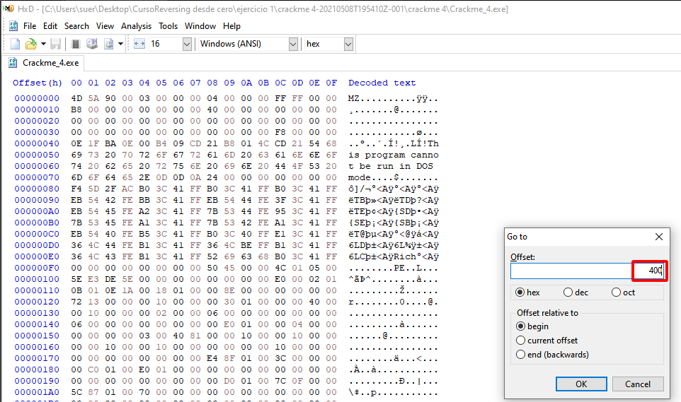
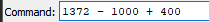

# Cracking Binaries

## Pre-requisites

### Registers

### Flags

### Virtual Address (VA)

.png>)

Virtual Address = Es una dirección de un programa cuando esta cargado en la memoria.

### Image Base

Image Base = Es la dirección del ejecutable en el Memory Map.

Mapiado del ejecutable.

### Relative Virtual Address (RVA)

RVA = VA - IMAGE BASE

Para calcular el RVA tenemos que restar la dirección de memoria con la dirección de Image Base

Esta es la dirección de Image Base

Calculamos las direcciones.

El resultado es 1372:

### Offset (File Offset)

File Offset = The location in RAM in which the file is located.

El número #722 es el File Offset.

Con un editor de Hexadecimal, vamos al offset 772.

Aquí podemos ver el OPCODE.

### Calculación del Offset

Para calcular el offset necesitamos `RVA - PE Header Size + .text PointerToRawData`

El Size es 1,000

El offset donde está el código es 400.

RVA - Image Base Size + .text PointerToRawData

Podemos ver que el resultado del offset es 772.

.png>)

### Desplazamientos

call = call directo, llama directamente a una dirección de memoria.

Si nos posicionamos en la instrucción y le damos a tecla Enter nos lleva a dirección que esta llamando.

jmp = salto incondicional, simplemente hace jump (siempre)

### Label / Etiqueta

Si le quito la etiqueta me va aparecer la dirección en donde va a saltar.

La dirección es 1F1755

`E8` es el OPCODE de la instrucción `call`. Los bytes a continuación son `C4030000` son el desplazamiento.

### Calcular la dirección del CALL

`Virtual Address + Desplazamiento en Little Endian + Cantidad de Bytes de la Instrucción`.

Como resultado tenemos 001F173B representada en hexadecimal como 0x001F173B

### Calcular la dirección del JMP

Podemos ver que tenemos una flecha que apunta para arriba.

`Virtual Address + Desplazamiento en Little Endian + Cantidad de Bytes de la Instrucción`.

El resultado es 001F11F0

Si nos paramos en la instrucción nos aparece esta ventanilla que nos indica a la dirección que va a brincar.

Si le damos enter pues brincamos a la dirección.

También si le damos a la tecla 'Space' podemos ver la dirección.

### Calcular la dirección de un salto Condicional Negativo

EA = es negativo

Cuando consideramos el Signo/Signed debemos dividir el tamaño / 2.

`Virtual Address + Desplazamiento en Little Endian + Cantidad de Bytes de la Instrucción`.

Como EA es negativo debemos escirbir F adelante.

Calculamos

Resultado

### Call Indirectos FF15 y \[dirección]

FF15 = call indirectos

### Diferencias de Call Indirecto

A diferencia del call directo, el indirecto contiene la dirección de donde va a llamar el programa y **NO** es un desplazamiento.

Vemos la dirección en Little Endian.

Si cambiamos el valor de esta dirección.

Editamos los valores de esta dirección.

Cambiamos los valores por la dirección 001F13B8 y lo escribimos en Little Endian.

Después de cambiar los valores lo podemos ver ahora en rojo.

El nombre de la función ahora desaparece

No vemos el comentario.

Ahora vamos a terminar llamando a esta dirección.

Si presionamos Enter nos lleva a la dirección que llamo.

Lo que hay DENTRO de esta dirección puede cambiar pero la dirección es constante (NO CAMBIA).

### JMP Indirectos FF25 y \[dirección]

FF25 = jmp indirectos

Con Ctrl+B abrimos Find Pattern...

Hacemos clic en alguno.

Podemos ver el OPCODE FF25.

La dirección también esta entre corechetes `[]`.

Si se cambia este valor hexadecimal pues va terminar saltando a el valor que este en esta dirección.

## Cracking Basics

### Changing the Logic

### Changing Hex Code

### Preventing the Logic from Uncracking

### Patching

