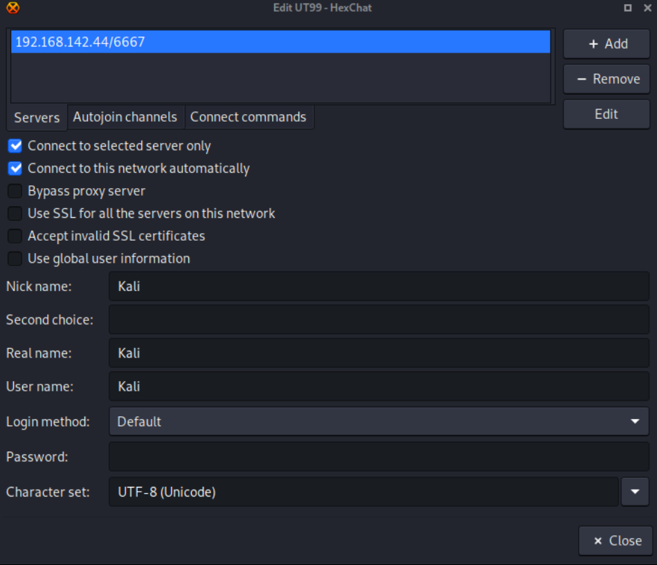
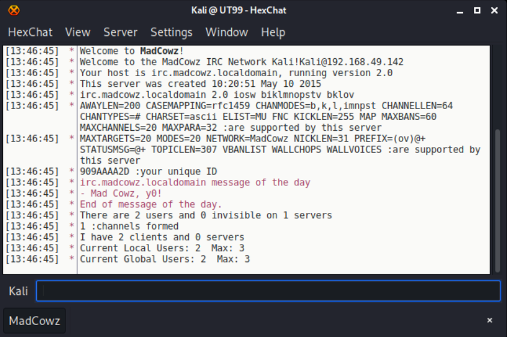

# IRC - 194,6667,6660,7000

## IRC

**Internet Relay Chat (IRC)** is a text-based chat system. It enables discussions among any number of participants in so-called conversation channels, as well as discussions between only two partners.



### Banner

We may be able to gather the banner with nc:

```
nc -nv <IP> <PORT>
```

IRC does support TLS:

```
openssl s_client -connect <IP>:<PORT>
openssl s_client -connect <IP>:<PORT> -quiet
```

### Scan IRC Services

We can use nmap to scan IRC services:

```
nmap -sV --script irc-botnet-channels,irc-info,irc-unrealircd-backdoor -p 194,6660-7000 <IP>
```

### Bruteforce IRC

We can use nmap to bruteforce an IRC:

```
nmap -sV --script irc-brute,irc-sasl-brute --script-args userdb=/path/users.txt,passdb=/path/pass.txt -p <PORT> <IP>
```

### Chat Enumeration

**Question**: Why HexChat?

**Answer:** In the case that we do have IRC open on a large range of ports 6660-7000,7007 and connecting to these ports with command line options is proving to be unreliable due to frequent disconnections. Then HexChat may help you and it has a GUI.

We can install `hexchat` with `apt update && apt install -y hexchat`.

With HexChat open add a network and use the settings as per shown below. Ensuring the correct IP is set.



After doing it, you can close the window and then connect to the new network. You should see a similar screen as below:



From here go to `Server --> Channel List --> Perform a wildcard * search on the default settings` to find the channel **#x (replace the x with the channel-name)**.
