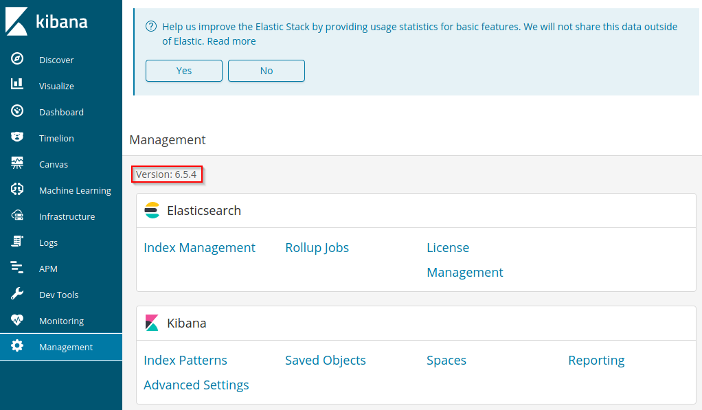
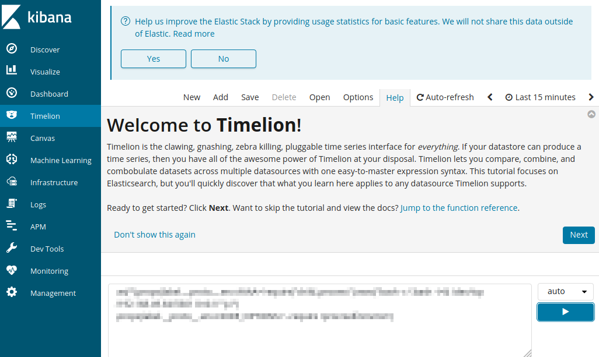

# Kibana - 5601

## Version Enumeration

### Management Pane

The management pane can reveal the versoin of Kibana.

Here is an example:

## Common Footholds/Exploits

### Timelion

Here is an example:

