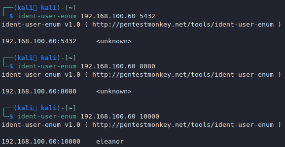

# Ident - 113

## Ident Information <a href="#basic-information" id="basic-information"></a>

Is an [Internet](https://en.wikipedia.org/wiki/Internet) [protocol](https://en.wikipedia.org/wiki/Protocol\_\(computing\)) that helps identify the **user** of a particular [TCP](https://en.wikipedia.org/wiki/Transmission\_Control\_Protocol) connection.

**Default port:** 113

```
PORT    STATE SERVICE  113/tcp open  ident
```

### Enumeration

We can use nmap nse scripts to enumerate IDENT, by default the (-sC) nmap option will identify every user of every running every port:

```
sudo nmap -sC -p 113 <IP>
```

In IDENT we can enumerate users and their corresponding services with iden-enum-users Perl script.

You may install it with `apt install ident-user-enum`.

```
ident-user-enum 10.10.10.10 22 113 139 445
ident-user-enum v1.0 ( http://pentestmonkey.net/tools/ident-user-enum )
​
10.10.10.10:22  root
10.10.10.10:113 identd
10.10.10.10:139 root
10.10.10.10:445 root
```

As `ident` is running we can use the Perl script `ident-user-enum` to identify which services are running under what user.

```
ident-user-enum <IP> <PORT-1>
ident-user-enum <IP> <PORT-2>
ident-user-enum <IP> <PORT-3>
```

Here is an example:


