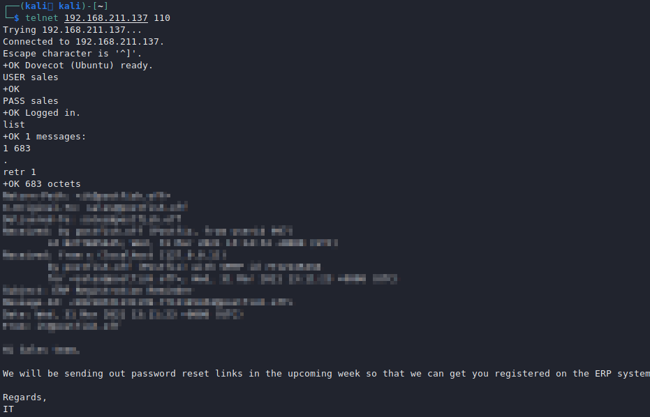

# POP - 110,995

## POP Information

POP is a computer networking and Internet standard protocol that extracts and retrieves email from a remote mail server for access by the host machine. POP is an application layer protocol in the OSI model that allows end users to retrieve and send email (from here).

POP clients typically connect to the server, retrieve all messages, store them on the client system, and then delete them from the server. POP comes in three flavors, with POP3 being the most popular.

Default ports: 110, 995(ssl)

```
PORT    STATE SERVICE
110/tcp open  pop3
```

## Enumeration

### Banner Grabbing

```
nc -nv <IP> 110
openssl s_client -connect <IP>:995 -crlf -quietC
```

### Capabilities

You can use the command CAPA to obtain the capabilities of the POP3 server.

### Nmap NSE Scripts

You can use the nmap nse scripts to enumerate pop3:

```
nmap --script "pop3-capabilities or pop3-ntlm-info" -sV -port <PORT> <IP> #All are default scripts
```

The pop3-ntlm-info plugin will return some "sensitive" data (Windows versions).

POP syntax

```
POP commands:
  USER uid           Log in as "uid"
  PASS password      Substitue "password" for your actual password
  STAT               List number of messages, total mailbox size
  LIST               List messages and sizes
  RETR n             Show message n
  DELE n             Mark message n for deletion
  RSET               Undo any changes
  QUIT               Logout (expunges messages if no RSET)
  TOP msg n          Show first n lines of message number msg
  CAPA               Get capabilities
```

Example:

```
wixnic@kali:~# telnet 10.20.10.10 110
 +OK beta POP3 server (JAMES POP3 Server 2.3.2) ready 
 USER wixnic    
 +OK
 PASS password
 +OK Welcome wixnic
​
 list
​
 +OK 2 1807
 1 786
 2 1021
​
 retr 1
​
 +OK Message follows
 From: john@htb.com
 Dear John Bills,
​
 Here is your login for remote desktop!
 username: username
 password: p@$$w0rd
```

### Enumeration with NC

```
$ nc -vvv $target 110
USER test
PASS test

#list all mails
LIST 

#Retrive the mail
retr mail_number
```

Here is an example:


