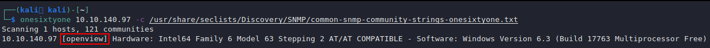
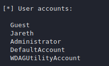

# SNMP - 161,162,10161,1062

## SNMP Information

**SNMP**, which stands for Simple Network Management Protocol, is a communication protocol that lets you monitor managed network devices including Routers, Switches, Servers, Printers and other devices that are IP enabled all through a single management system/software.



## SNMP Enumeration

Because SNMP is based on UDP, a stateless protocol, it is vulnerable to IP spoofing and replay attacks. Furthermore, the widely used SNMP protocols versions 1, 2, and 2c do not provide traffic encryption, allowing SNMP information and credentials to be collected easily over a local network. SNMP protocols have weak authentication techniques as well, and is really common to see them left with the default public and private community strings.

### SNMP MIB Tree

The SNMP Management Information Base (MIB) is a database that typically contains information about network management. The database is laid out in the form of a tree, with branches representing various organizations and network services. The tree's leaves correspond to specific variable values that an external user can then access and probe. The IBM Knowledge Center has a variety of MIB tree-related information.

#### SNMP MIB Windows

Interesting MIB table for Windows:

| MIB Values             | Windows Parameters |
| ---------------------- | ------------------ |
| 1.3.6.1.2.1.25.1.6.0   | System Processes   |
| 1.3.6.1.2.1.25.4.2.1.2 | Running Programs   |
| 1.3.6.1.2.1.25.4.2.1.4 | Processes Path     |
| 1.3.6.1.2.1.25.2.3.1.4 | Storage Units      |
| 1.3.6.1.2.1.25.6.3.1.2 | Software Name      |
| 1.3.6.1.4.1.77.1.2.25  | User Accounts      |
| 1.3.6.1.2.1.6.13.1.3   | TCP Local Ports    |

## SNMP Install MIBs

We can install MIBs with the following package:

```bash
sudo apt install snmp-mibs-downloader
```

This will convert numbers to strings.

## SNMP Scanning

We can use nmap to look for open SNMP ports, as demonstrated in the sample below. The `—open` option is used to limit the output to only display open ports and the `-sU` option is used to do UDP scanning:

```
sudo nmap -sU --open -p 161 <IP> -oG open-snmp.txt
```

### snmpcheck

We can check for SNMP with:

```
sudo snmpcheck <IP>
```

### onesixtyone

Bruteforce community strings:

```
# echo public > community
# echo private >> community
# echo manager >> community
onesixtyone -c community -i <IP>
```

### snmapwalk

Enumerate the public community string with MIBs:

```
snmpwalk -c public -v1 <IP>
snmpwalk -c public -v2c <IP>
snmpwalk -Os -c public -v 1 10.10.10.20
```

Recommended enumeration approach:

```bash
snmpwalk -v 2c -c public 10.10.10.92 > snmpwalk_public
```

Enumerate with a specific MIB value:

```
snmpwalk -c public -v1 <IP> <MIB_Value>
snmpwalk -c public -v2c <IP> <MIB_Value>
```

## Usage Scenario

You can try to find community strings with onesixtyone using the `-c` parameter and a wordlist:

```
onesixtyone 10.10.140.97 -c /usr/share/seclists/Discovery/SNMP/common-snmp-community-strings-onesixtyone.txt
```



As you can see above `onesixtyone` has identified the community string 'openview'. We can then run this with snmp-check to dump all available SNMP information.

```
snmp-check -c openview 10.10.140.97
```

Looking through the results we find a non default username.



### Windows SNMP Enumeration

We can use a tool like snmpwalk to probe and query SNMP values if we know the SNMP read-only community string, which is usually "public." Otherwise, checkout the Usage Scenario (above), to understand how can find the community string (if any).

#### Enumerating the Entire MIB Tree

This command uses the `-c` option to specify the community string, the`-v` option to specify the SNMP version number, and the `-t` 10 option to increase the timeout duration to 10 seconds to enumerate the full MIB tree:

```
snmpwalk -c public -v1 -t 10 <IP>
```

#### Enumerating Windows Users

This example enumerates the Windows users:

```
snmpwalk -c public -v1 <IP> 1.3.6.1.4.1.77.1.2.25
```

#### Enumerating Running Windows Processes

This example enumerates the running Windows processes:

```
snmpwalk -c public -v1 <IP> 1.3.6.1.2.1.25.4.2.1.2
```

#### Enumerating Open TCP Ports

This example enumerates the open TCP ports:

```
snmpwalk -c public -v1 <IP> 1.3.6.1.2.1.6.13.1.3
```

#### Enumerating Installed Software

This example enumerates installed software:

```
snmpwalk -c public -v1 <IP> 1.3.6.1.2.1.25.6.3.1.2
```

# SNMP IPv6 Enumeration

We can enumerate IPv6 in SNMP using tools/scripts such as [Enyx](https://github.com/trickster0/Enyx):

```sh
$ python /opt/Enyx/enyx.py 2c public 10.10.10.92

###################################################################################
#                                                                                 #
#                      #######     ##      #  #    #  #    #                      #
#                      #          #  #    #    #  #    #  #                       #
#                      ######    #   #   #      ##      ##                        #
#                      #        #    # #        ##     #  #                       #
#                      ######  #     ##         ##    #    #                      #
#                                                                                 #
#                           SNMP IPv6 Enumerator Tool                             #
#                                                                                 #
#                   Author: Thanasis Tserpelis aka Trickster0                     #
#                                                                                 #
###################################################################################


[+] Snmpwalk found.
[+] Grabbing IPv6.
[+] Loopback -> 0000:0000:0000:0000:0000:0000:0000:0001
[+] Unique-Local -> dead:beef:0000:0000:0250:56ff:fe8f:ddd4
[+] Link Local -> fe80:0000:0000:0000:0250:56ff:fe8f:ddd4
```


