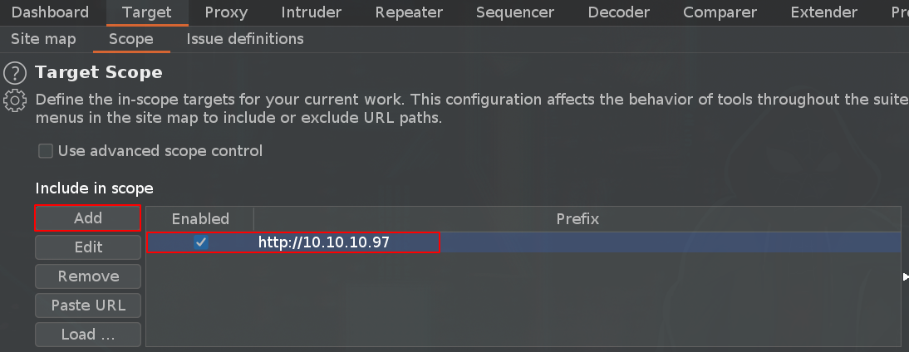
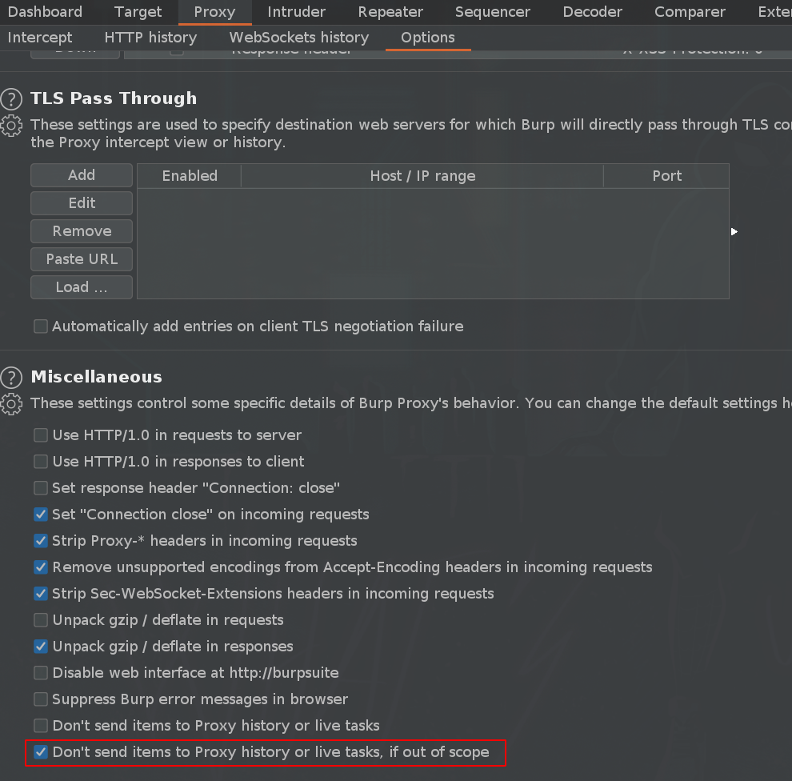

# BurpSuite

## FoxyProxy

A common proxy extension that we can use in Firefox is this one:



## Scope

Define a scope:

Don't send items that are out of scope:

## Intruder

### Payloads -&gt; Payload Encoding

Tokens can contain special characters so URL-encode should be disabled:

